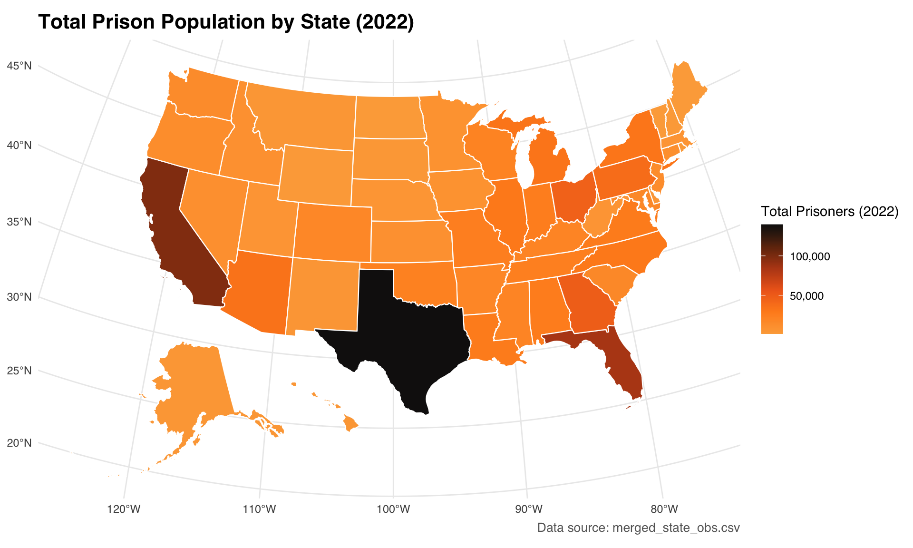
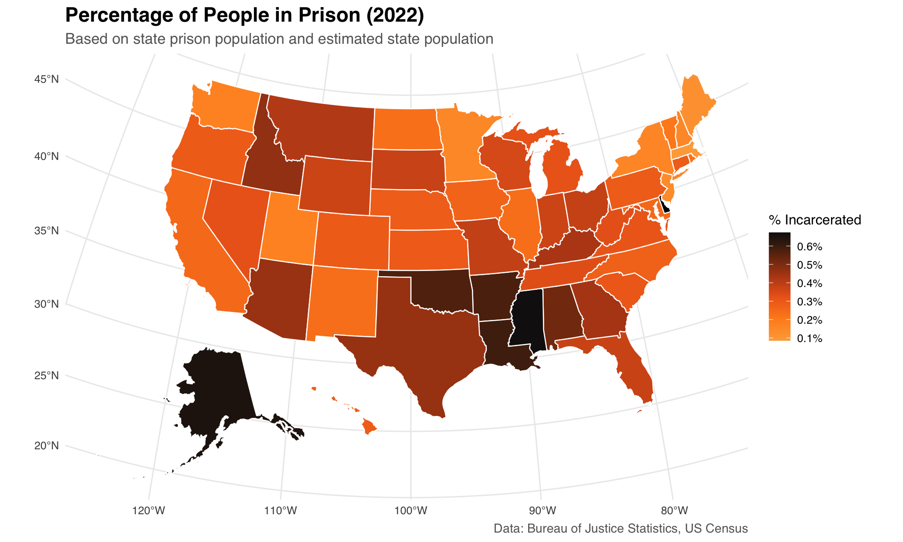

::: {.cell}

```{.r .cell-code}
library(usmap)
library(tidyverse)

df <- read_csv("processed_data/merged_state_obs.csv")

map_data <- df %>%
  filter(jurisdiction != "Federal") %>%
  select(state = jurisdiction, total_prison_pop_22) %>%
  mutate(state = state.name[match(state, state.name)]) %>%
  drop_na()

# Plot the choropleth map
plot_usmap(data = map_data, values = "total_prison_pop_22", color = "white") +
  scale_fill_continuous(
    low = "#CCE5FF", 
    high = "#003366", 
    name = "Total Prisoners (2022)", 
    label = scales::comma
  ) +
  labs(
    title = "Total Prison Population by State (2022)", 
    caption = "Data source: merged_state_obs.csv"
  ) +
  theme_minimal(base_family = "sans") +   # safest font
  theme(
    legend.position = "right",
    plot.title = element_text(size = 16, face = "bold"),
    plot.caption = element_text(size = 10, color = "gray40")
  )
```

::: {.cell-output-display}
{width=960}
:::
:::

::: {.cell}

```{.r .cell-code}
library(usmap)
library(tidyverse)

# Load and prepare data
df <- read_csv("processed_data/merged_state_obs.csv")

map_data <- df %>%
  filter(jurisdiction != "Federal") %>%
  select(state = jurisdiction, total_prison_pop_22, num_prison_workers) %>%
  mutate(
    state = state.name[match(state, state.name)],
    pct_working = (num_prison_workers / total_prison_pop_22) * 100,
    pct_working = ifelse(pct_working > 100, 100, pct_working)
  )

# Plot choropleth with missing data
plot_usmap(data = map_data, values = "pct_working", color = "white") +
  scale_fill_continuous(
    low = "#CCE5FF",
    high = "#003366",
    name = "% Prisoners Working",
    label = scales::percent_format(scale = 1),
    na.value = "black"
  ) +
  labs(
    title = "Percentage of Prisoners Working by State (2022)",
    subtitle = "States with missing data shown in black",
  ) +
  theme_minimal(base_family = "sans") +
  theme(
    legend.position = "right",
    plot.title = element_text(size = 16, face = "bold"),
    plot.subtitle = element_text(size = 12, color = "gray40"),
    plot.caption = element_text(size = 10, color = "gray40")
  )
```

::: {.cell-output-display}
{width=960}
:::
:::

